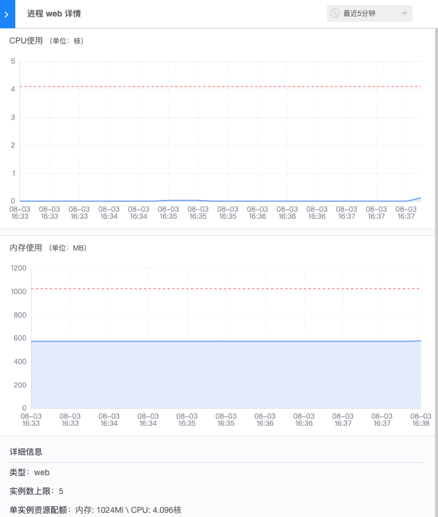
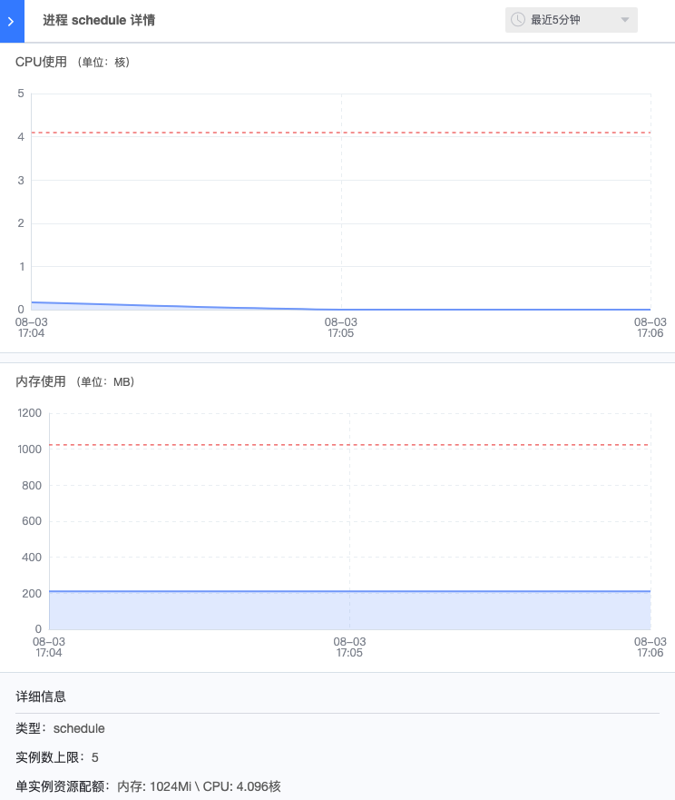

<!-- TOC -->

- [1. invoke](#1-invoke)
- [2. schedule](#2-schedule)

<!-- /TOC -->


<a id="toc_anchor" name="#1-invoke"></a>

# 1. invoke

在默认插件进程配置(`gunicorn bk_plugin_runtime.wsgi --timeout 120 -k threads -w 8 --max-requests=1000`)，只启动了一个 API 进程实例的情况下，使用 [hey](https://github.com/rakyll/hey/) 进行空 invoke 测试：

```
$ hey -D invoke.json -T application/json -m POST -c 50 -n 1000 $INVOKE_API

Summary:
  Total:        4.6165 secs
  Slowest:      0.8501 secs
  Fastest:      0.0670 secs
  Average:      0.1928 secs
  Requests/sec: 216.6150
  
  Total data:   124000 bytes
  Size/request: 124 bytes

Response time histogram:
  0.067 [1]     |
  0.145 [437]   |■■■■■■■■■■■■■■■■■■■■■■■■■■■■■■■■■■■■■■■■
  0.224 [280]   |■■■■■■■■■■■■■■■■■■■■■■■■■■
  0.302 [135]   |■■■■■■■■■■■■
  0.380 [63]    |■■■■■■
  0.459 [55]    |■■■■■
  0.537 [11]    |■
  0.615 [11]    |■
  0.693 [4]     |
  0.772 [2]     |
  0.850 [1]     |


Latency distribution:
  10% in 0.0947 secs
  25% in 0.1066 secs
  50% in 0.1526 secs
  75% in 0.2465 secs
  90% in 0.3500 secs
  95% in 0.4272 secs
  99% in 0.5833 secs

Details (average, fastest, slowest):
  DNS+dialup:   0.0005 secs, 0.0670 secs, 0.8501 secs
  DNS-lookup:   0.0003 secs, 0.0000 secs, 0.0065 secs
  req write:    0.0000 secs, 0.0000 secs, 0.0015 secs
  resp wait:    0.1921 secs, 0.0669 secs, 0.8499 secs
  resp read:    0.0001 secs, 0.0000 secs, 0.0008 secs

Status code distribution:
  [200] 1000 responses
```



<a id="toc_anchor" name="#2-schedule"></a>

# 2. schedule

在默认插件调度进程配置(`celery worker -A blueapps.core.celery -P threads -n schedule_worker@%h -c 500 -Q plugin_schedule -l INFO`)，只启动了一个 Schedule 进程实例的情况下，发起 `1000` 个空调度执行请求，每秒能够处理的调度次数为 `125`。


